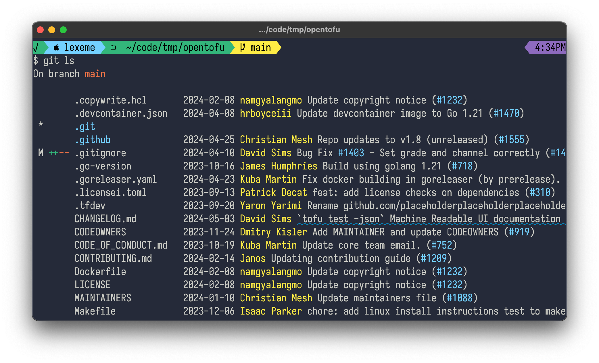

# git-ls

list the files in the current directory along with a useful summary of their git status and helpful hyperlinks.

The output is nicely colored:

In a terminal that supports [OSC8 links](https://gist.github.com/egmontkob/eb114294efbcd5adb1944c9f3cb5feda) such as kitty, iterm or wezterm, `git ls` will provide helpful hyperlinks.

- file names are linked to files
- commit authors are linked to their list of commits
- PR numbers are linked to the PR

In a properly-configured terminal, this means that you can click on filenames to open them in your preferred editor, or click on a PR number in a commit status to go straight to that PR in your browser.

## building

Run `make`, which will result in a `git-ls` binary in the current directory

## installing

Put `git-ls` anywhere on your path, and you can then call it as `git ls`
