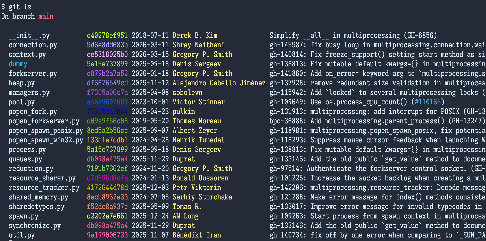
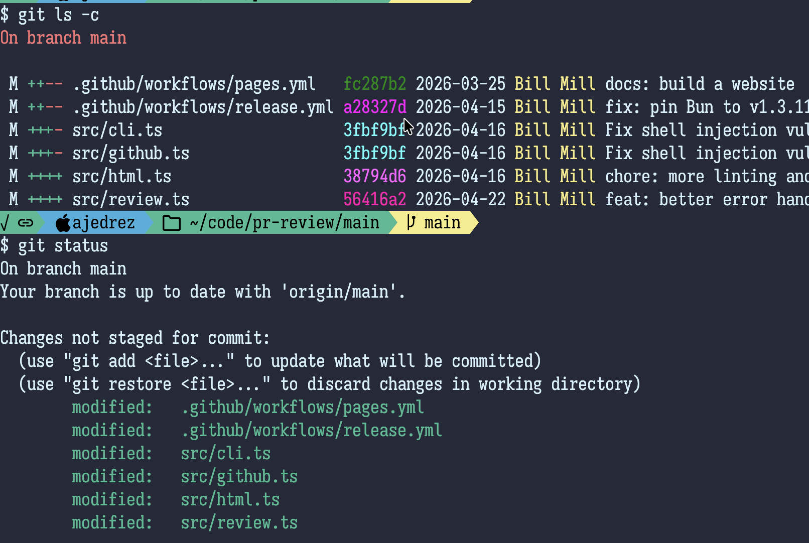
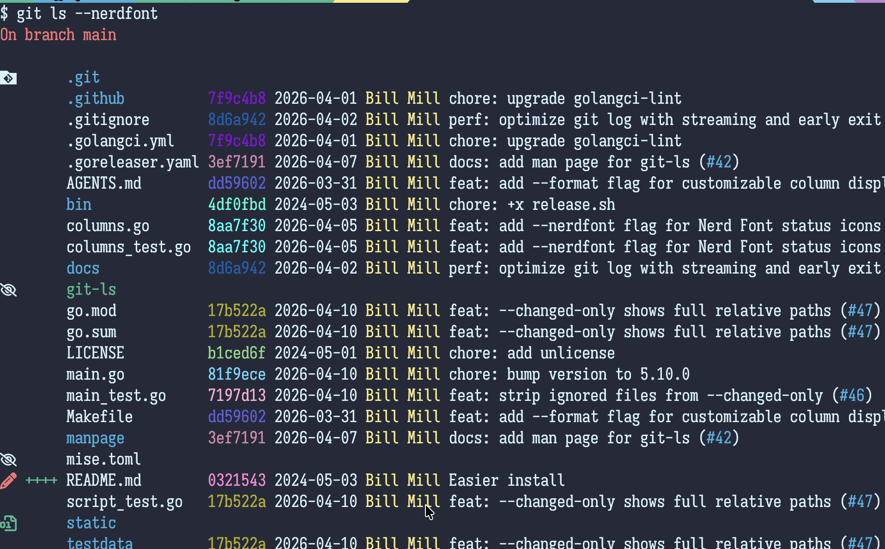

# git-ls

list the files in the current directory along with a useful summary of their git status and helpful hyperlinks.

The output is nicely colored:

In a terminal that supports [OSC8 links](https://gist.github.com/egmontkob/eb114294efbcd5adb1944c9f3cb5feda) such as kitty, iterm or wezterm, `git ls` will provide helpful hyperlinks.

- file names are linked to files
- commit messages are linked to the commits
- commit authors are linked to their list of commits
- PR numbers are linked to the PR

In a properly-configured terminal, this means that you can click on filenames to open them in your preferred editor, or click on a PR number in a commit status to go straight to that PR in your browser.

## installing

- on a mac: `brew install llimllib/git-ls/git-ls`
- everywhere else: download the [latest release](https://github.com/llimllib/git-ls/releases) for your platform
  - Put `git-ls` anywhere on your path, and you can then call it as `git ls`
  - Windows users: I'd love your help to make this work on windows! Please leave a comment at issue [#14](https://github.com/llimllib/git-ls/issues/14)

## building

Run `make`, which will result in a `git-ls` binary in the current directory

## changes only

When `git-ls` is run with `-c` or `--changed-only`, it reports only the files that have changed, which makes it function similarly to `git status`

## nerd font mode

When `git-ls` is run with `--nerdfont`, it uses an experimental mode with icons replacing the traditional letters that `git status` uses to report modifications, additions, and ignored files:

This is still very WIP, let me know if you like it or have suggestions for changes
